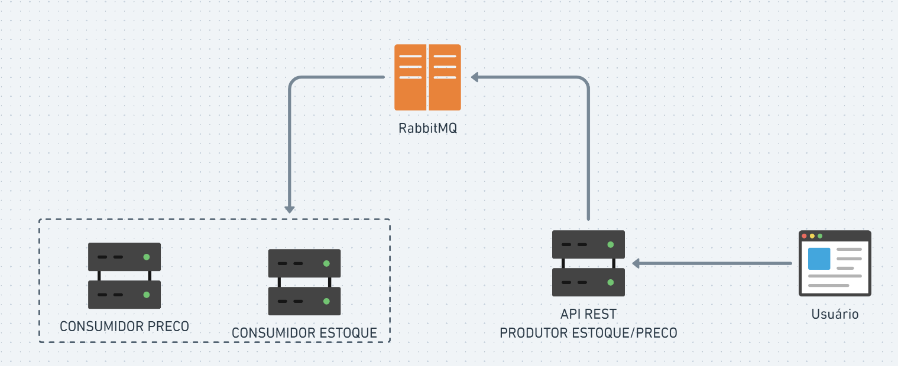

# Comunicação de Microserviços com RabbitMQ
Este projeto o RabbitMQ como intermediador de mensagens para a comunicação entre diferentes componentes. A arquitetura consiste em um produtor de mensagens, que é um servidor de API responsável por lidar com as solicitações de atualização de estoque e preço feitas pelos usuários. Além disso, existem dois consumidores de mensagens, um desenvolvido em Java com Spring e outro em Node.js, que consomem mensagens da fila RabbitMQ e as processam conforme necessário.

 
    

## Visão Geral do RabbitMQ em Ação: Consumidores Processando Mensagens

 
    

## Componentes do Projeto
Produtor de Mensagens (Servidor de API):
O servidor de API é responsável por lidar com as solicitações de atualização de estoque e preço feitas pelos usuários. Quando os usuários fazem uma solicitação para atualizar o estoque ou o preço de um produto, o servidor de API cria objetos EstoqueDto ou PrecoDto, contendo os detalhes relevantes da atualização.

## RabbitMQ como Intermediador de Mensagens:
O RabbitMQ atua como intermediador de mensagens para permitir a comunicação entre os componentes do sistema. O servidor de API envia as mensagens contendo os objetos EstoqueDto e PrecoDto para filas específicas no RabbitMQ.

## Consumidor em Java com Spring:
O primeiro consumidor é desenvolvido em Java usando o framework Spring. Ele consome as mensagens da fila RabbitmqConstantes.FILA_ESTOQUE e RabbitmqConstantes.FILA_PRECO para atualizações de estoque e preço, respectivamente. O consumidor de Java processa as informações recebidas, neste caso, apenas imprime os detalhes da atualização no console.

## Consumidor em Node.js:
O segundo consumidor é desenvolvido em Node.js. Ele consome mensagens da fila RabbitmqConstantes.FILA_ESTOQUE. O código fornecido conecta-se ao RabbitMQ, consome mensagens e imprime o conteúdo da mensagem no console. Em uma aplicação real, poderia realizar outras tarefas ou processamentos com base nas informações recebidas.

## Configuração e Execução
Para executar o projeto, siga as etapas abaixo:

### Instalação do RabbitMQ:
Certifique-se de ter o RabbitMQ instalado e em execução na máquina local ou em um servidor acessível. Para instalação e configuração do RabbitMQ, consulte a documentação oficial em https://www.rabbitmq.com/documentation.html.

### Configuração do Projeto:
Verifique e ajuste, se necessário, as configurações de conexão ao RabbitMQ nos códigos do produtor (servidor de API) e consumidores (Java com Spring e Node.js). As configurações do RabbitMQ, como host, porta, nome de usuário e senha.

### Dependências:
Certifique-se de que todas as dependências necessárias estejam presentes no projeto. Verifique o arquivo pom.xml (Java com Spring) e o arquivo package.json (Node.js) para garantir que todas as dependências, incluindo o cliente RabbitMQ (como amqp para Node.js e spring-boot-starter-amqp para Java com Spring), estejam corretamente declaradas.

## Executando o Projeto:
Inicie o servidor de API (produtor) e os consumidores (Java com Spring e Node.js) em seus próprios containers Docker. Certifique-se de que todos os containers estejam na mesma rede Docker para permitir a comunicação entre eles.

## Testando a Comunicação Assíncrona:
Postman para enviar solicitações ao servidor de API (produtor) e observe os resultados nos consumidores de mensagens. Ao fazer uma solicitação para atualizar o estoque ou o preço de um produto, você verá as mensagens sendo consumidas e processadas pelos consumidores (Java com Spring e Node.js).
